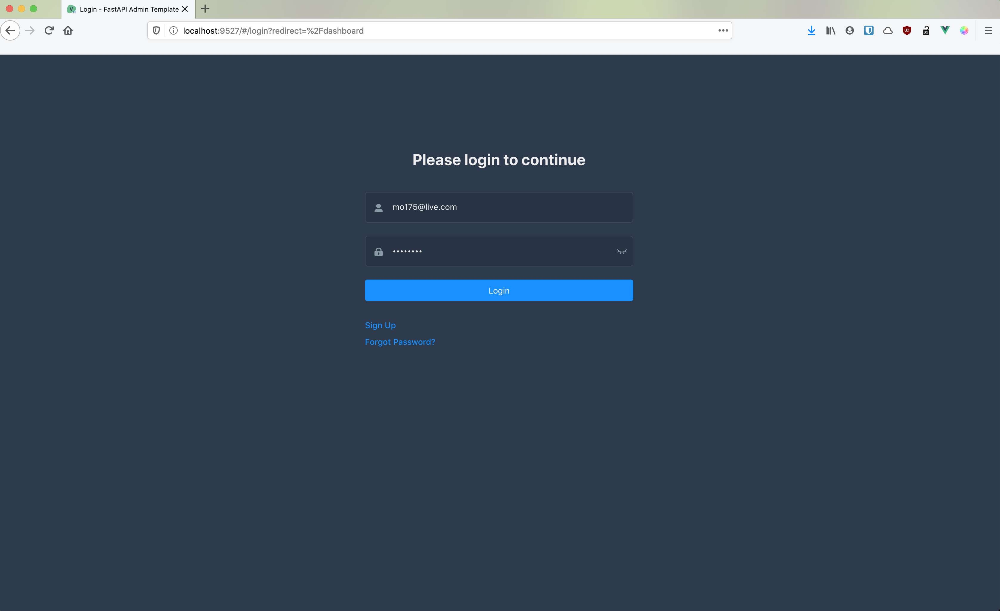
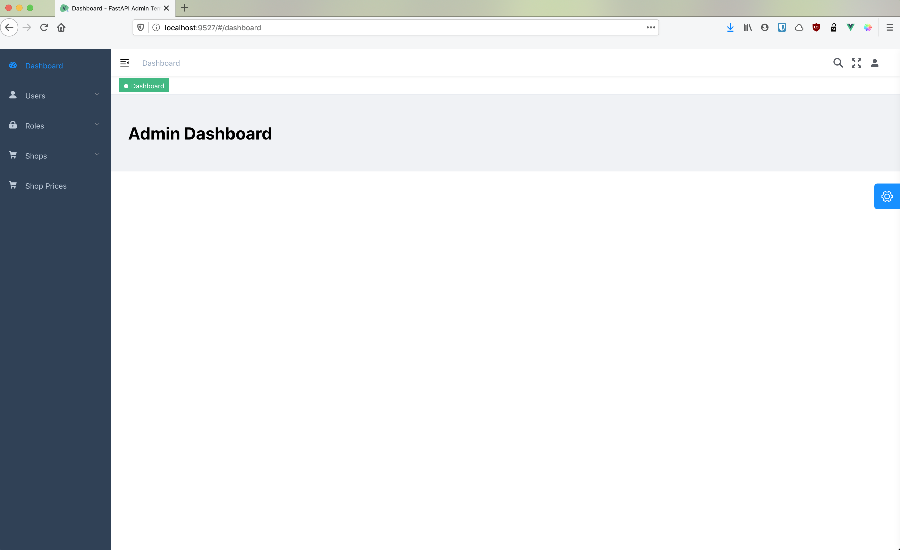
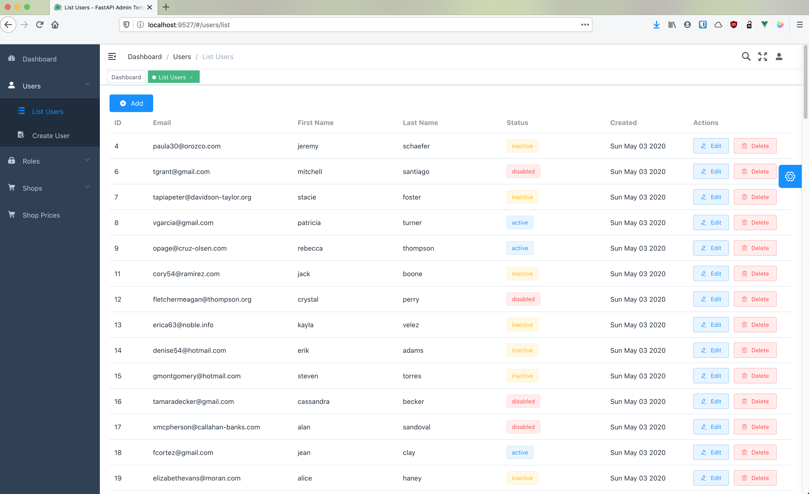
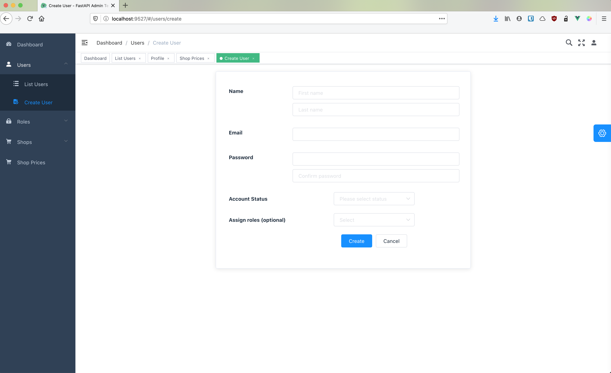
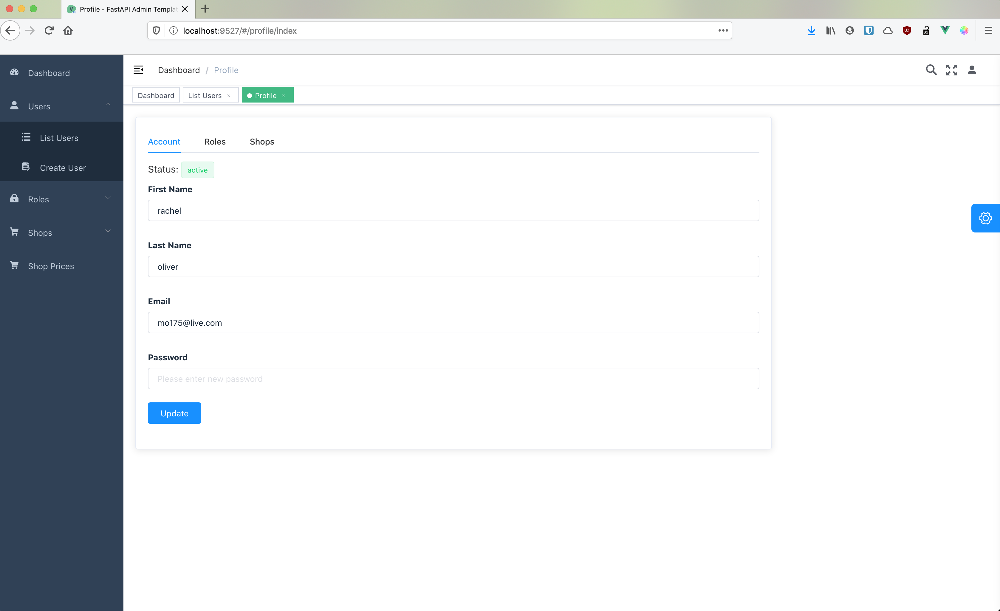
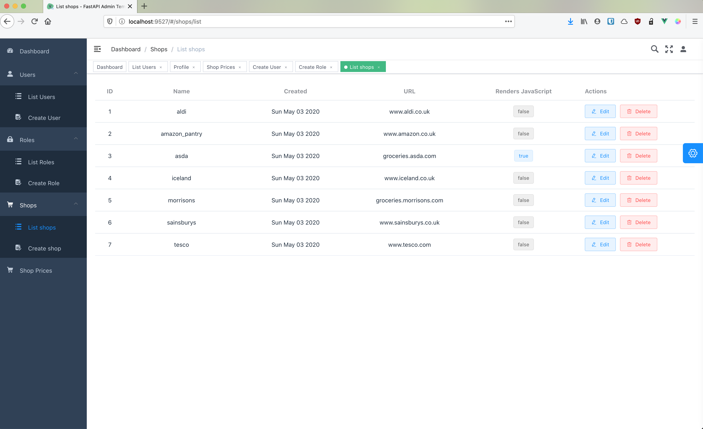
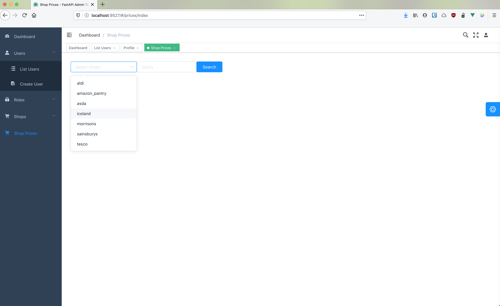
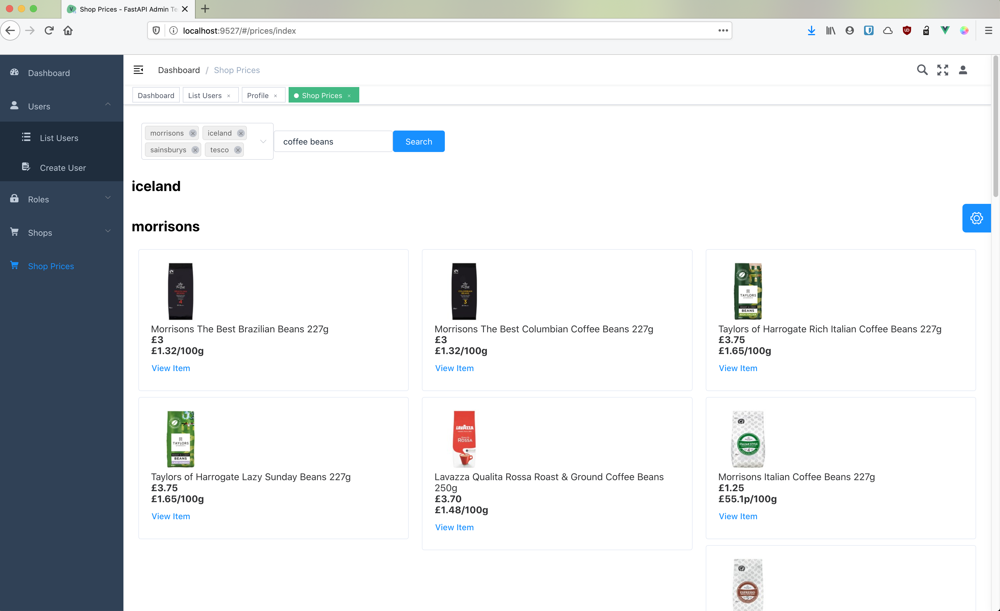

# Fullstack Price Aggregator
UK supermarket price aggregator via web scraping. This was developed for my university project as an MVP so there are aspects which don't function correctly. I may update it in the future.

## Features
* Python REST backend via FastAPI
* VueJS Frontend SPA with TypeScript using [this template](https://github.com/Armour/vue-typescript-admin-template).
* JWT Authentication between backend and frontend
* CLI
* [Docker](https://github.com/docker)
* [Poetry](https://github.com/python-poetry/poetry)
* Web Scraped prices via [selectorlib](https://selectorlib.com/)
* Scrape JavaScript enabled pages using [splash](https://github.com/scrapinghub/splash)

## Setup
Ensure you have Docker and Node.js installed.

1. Clone this repository
2. cd into project root and run `docker-compose up --build -d`. The starts the backend and on first run will build all the necessary containers which can take a few minutes.
3. Once the backend has finished building, obtain a shell with `docker-compose exec backend bash`.
4. To initialise the database run `python manage.py createdb` from within the bash shell.
    * (Optional) To seed the db with dummy data run `python manage.py seeddb` 
    Note all passwords are set to **password**
5. `cd` into the client directory run `npm install` which will install the required node modules.
6. run `npm run serve` which will serve the client frontend.

## Project URLs

| URL                                      | Description                                                                                 |
|:----------------------------------------:|:--------------------------------------------------------------------------------------------|
| [0.0.0.0:8000/api](0.0.0.0:8000/api)     | Backend JSON API                                                                            |
| [0.0.0.0:8000/docs](0.0.0.0:8000/docs)   | Backend OpenAPI/Swagger-generated API Reference Documentation                               |
| [0.0.0.0:8000/redoc](0.0.0.0:8000/redoc) | Alternative interactive documentation provided by [ReDoc](https://github.com/Redocly/redoc) |
| [localhost:9527](localhost:9527)         | Frontend VueJS Single Page Application                                                      |

## CLI
The backend includes a CLI which is heavily inspired by [Netflix's Dispatch](https://github.com/Netflix/dispatch).

[`typer`](https://github.com/tiangolo/typer) (same author as FastAPI) was used to create a CLI for the project and is accessed via [manage.py](./server/manage.py).

To run commands you will need to a shell running inside the backend container with:
    
    docker-compose run backend bash

To see all the available commands:

    root@72293bee6b37:/app# python manage.py 
    Usage: manage.py [OPTIONS] COMMAND [ARGS]...
    
    Options:
      --help  Show this message and exit.
    
    Commands:
      config      Display application configuration.
      createdb    Creates an empty database.
      createrole  Add role to database.
      createuser  Create new user in the database.
      develop     Start a development server with reload.
      dropdb      Drop the existing database.
      routes      Display application routes and dependencies.
      seeddb      Add fake data to database.
      shell       Starts an interactive shell with app object imported.

#### Routes

    root@72293bee6b37:/app# python manage.py routes
    
    Application Endpoints
    Path                           Methods    Dependencies
    -----------------------------  ---------  --------------------------------------------------------
    /api/v1/users/                 GET        ['RoleChecker: Roles: admin,user']
    /api/v1/users/                 POST       ['RoleChecker: Roles: admin,user']
    /api/v1/users/{id}             GET        ['RoleChecker: Roles: admin,user']
    /api/v1/users/{id}             PUT        ['RoleChecker: Roles: admin,user']
    /api/v1/users/{id}             DELETE     ['RoleChecker: Roles: admin,user']
    /api/v1/users/{id}/roles       GET        ['RoleChecker: Roles: admin,user']
    /api/v1/users/{id}/roles       PUT        ['RoleChecker: Roles: admin,user']
    /api/v1/users/{id}/shops       GET        ['RoleChecker: Roles: admin,user']
    /api/v1/users/{id}/shops       PUT        ['RoleChecker: Roles: admin,user']
    /api/v1/roles/                 GET        ['RoleChecker: Roles: admin,user']
    /api/v1/roles/                 POST       ['RoleChecker: Roles: admin,user']
    /api/v1/roles/{id}             GET        ['RoleChecker: Roles: admin,user']
    /api/v1/roles/{id}             PUT        ['RoleChecker: Roles: admin,user']
    /api/v1/roles/{id}             DELETE     ['RoleChecker: Roles: admin,user']
    /api/v1/shops/                 GET        ['RoleChecker: Roles: admin,user']
    /api/v1/shops/                 POST       ['RoleChecker: Roles: admin,user']
    /api/v1/shops/{id}             PUT        ['RoleChecker: Roles: admin,user']
    /api/v1/shops/{id}             DELETE     ['RoleChecker: Roles: admin,user']
    /api/v1/shops/listings/        GET        ['RoleChecker: Roles: admin,user']
    /api/healthcheck               GET        []

#### Config

    python manage.py config
    
    Application Configuration
    Setting                     Value(s)
    --------------------------  --------------------------------------------------------------------
    APP_DIR                     /app/app
    STATIC_DIR                  /app/app/static
    EMAIL_TEMPLATES_DIR         /app/app/static/email-templates/html
    PROJECT_NAME                Fastapi Backend
    SERVER_HOST                 0.0.0.0
    CORS_WHITELIST              ['http://localhost', 'http://localhost:8000', 'http://0.0.0.0:8000']
    FASTAPI_ENV                 development
    DEBUG                       False
    LOG_LEVEL                   debug
    FIRST_SUPERUSER             user@example.com
    FIRST_SUPERUSER_PASSWORD    a5dbf43e07f4d19e5b73bc89a8f74
    USERS_OPEN_REGISTRATION     True
    SECRET_KEY                  **********
    JWT_AUTH_LIFETIME_SECONDS   604800
    JWT_EMAIL_LIFETIME_SECONDS  3600
    SMTP_USER                   admin@backend.com
    SMTP_PASSWORD               **********
    SMTP_TLS                    False
    SMTP_SSL                    False
    SMTP_HOST                   mailhog
    SMTP_PORT                   1025
    POSTGRES_USER               postgres
    POSTGRES_PASSWORD           **********
    POSTGRES_HOST               postgres
    POSTGRES_PORT               5432
    POSTGRES_DB                 fastapi_backend

## Frontend views

### Login view

### Admin dashboard view

### User CRUD view

### User create view

### User profile view

### Shop CRUD view

### Shop select view

### Scraped listings view

